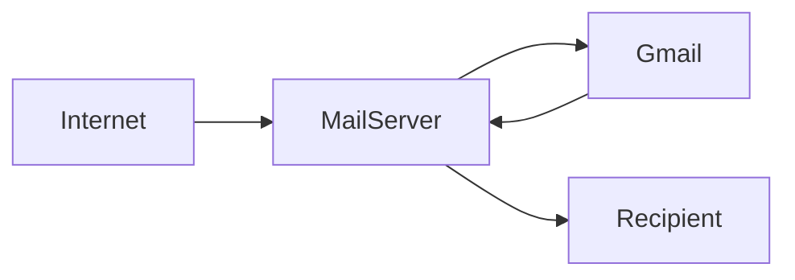
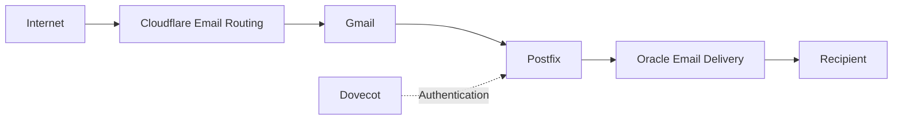

# MailBridge

I built this project because I wanted to use custom-domain email addresses with Gmail without paying for Google Workspace or running a traditional mail server.

The original idea sounded simple:

- Receive email on my domain
- Read everything in Gmail
- Send mail from Gmail using custom aliases
- Avoid mailbox hosting
- Avoid managing IMAP
- Avoid storing email on a VPS

It ended up being a useful exercise in understanding how modern email systems actually work.

---

## What It Does

Incoming mail:

```text
Internet
    ↓
Cloudflare Email Routing
    ↓
Gmail
```

Outgoing mail:

```text
Gmail
    ↓
Postfix
    ↓
Oracle Email Delivery
    ↓
Recipient
```

Authentication:

```text
Gmail
    ↓
Postfix
    ↓
Dovecot
```

The server does not store email.

There are no mailboxes, no IMAP service, and no local message storage.

The VPS is only responsible for SMTP submission and authentication.

---

## Why I Built It

I wanted addresses such as:

```text
hello@example.com
contact@example.com
support@example.com
noreply@example.com
```

without:

- Google Workspace
- Microsoft 365
- mailbox hosting
- IMAP administration
- local email storage

I also wanted to understand where email actually becomes complicated.

As it turns out, the difficult part is not receiving email.

The difficult part is sending email reliably.

---

## Constraints

A few requirements shaped every decision:

- Gmail had to remain the primary interface
- No mailbox hosting
- No local email storage
- Professional deliverability
- Low operational overhead

There was also one platform limitation that completely changed the design:

```text
Oracle Cloud blocks outbound port 25.
```

That ruled out direct SMTP delivery almost immediately.

---

## How The Architecture Evolved

### Initial Idea

The first design looked something like this:



One server.

One place to manage everything.

Simple in theory.

---

### Solving Inbound Email

Cloudflare Email Routing changed the project almost immediately.


Once this was working:

- mailbox hosting disappeared
- IMAP disappeared
- mail storage disappeared

Inbound email was effectively solved.

---

### Direct SMTP Delivery

For outbound mail, I initially planned to send directly from Postfix.


That failed.

Oracle blocks outbound TCP/25, which prevents direct SMTP delivery to recipient mail servers.

The architecture needed a relay.

---

### Evaluating Stalwart

Before settling on Postfix, I spent some time evaluating Stalwart Mail Server.

The appeal was obvious:

- modern architecture
- integrated services
- simpler deployment model

In practice I ran into deployment and authentication issues.

I eventually moved to Postfix because it was easier to troubleshoot and had a much larger ecosystem behind it.

---

### Gmail Authentication Problems

After Postfix was running, Gmail still could not send mail through it.

Authentication failed repeatedly.

The missing component was Dovecot.

Most people associate Dovecot with mailbox access.

In this project it serves a much smaller purpose:

```text
Dovecot
    ↓
SMTP Authentication
```

Once Dovecot was integrated as the SASL backend, Gmail authentication started working.

---

### Oracle Authentication Failure

The next problem came from Oracle Email Delivery:

```text
535 Authentication required
```

Postfix was not correctly using the relay credentials.

After correcting the SASL configuration and rebuilding the password map, authentication succeeded.

---

### Oracle Authorization Failure

The next error looked similar but turned out to be a completely different problem:

```text
535 Authorization failed
Envelope From address not authorized
```

Authentication was working.

Authorization was not.

The SMTP account was valid, but Oracle had not approved the sender identity being used.

After configuring approved senders, outbound delivery finally succeeded.

---

### Alias Support

One requirement from the beginning was support for multiple aliases:

```text
hello@
contact@
support@
help@
noreply@
abuse@
postmaster@
```

All aliases now send through a single authenticated SMTP account while preserving the correct sender identity.

---

## What Finally Worked

The final outbound path became:

```text
Gmail
    ↓
Postfix
    ↓
Oracle Email Delivery
    ↓
Recipient
```

while Dovecot handled SMTP authentication.

At that point:

- Gmail could authenticate
- Oracle accepted the relay
- authorized aliases could send mail
- messages reached external inboxes successfully

---

## Final Architecture



---

## Validation

The system was tested end-to-end.

### Inbound Mail

```text
External Sender
    ↓
Cloudflare Email Routing
    ↓
Gmail Inbox
```

Result:

Successful delivery

### Outbound Mail

```text
Gmail
    ↓
Postfix
    ↓
Oracle Email Delivery
    ↓
Recipient
```

Result:

Successful delivery

### Example Log Entries

```text
sasl_username=gmailrelay

to=<recipient@example.com>

dsn=2.0.0

status=sent (250 Ok)
```

These confirmed:

- SMTP authentication worked
- relay authentication worked
- sender authorization worked
- delivery succeeded

---

## Lessons Learned

### Receiving Email Is Easy

Cloudflare Email Routing solved inbound email much faster than expected.

### Sending Email Is Hard

Authentication, authorization, deliverability, DNS records, and reputation all matter.

Getting a message accepted by a remote server is only part of the problem.

### Authentication And Authorization Are Different

This was responsible for one of the longest debugging sessions in the project.

A valid SMTP login does not automatically grant permission to use every sender address.

### Cloud Providers Shape Architecture

The final outbound design exists largely because Oracle blocks direct SMTP delivery on port 25.

### Email Is Mostly About Trust

Before this project I assumed SMTP was the difficult part.

In reality, SPF, DKIM, DMARC, reputation, and policy enforcement are just as important.

---

## Future Improvements

- Terraform-managed DNS
- Automated deployment with Ansible
- Monitoring and alerting
- Secondary outbound relay
- Infrastructure as Code

---

## Documentation

| File | Purpose |
|--------|----------|
| docs/glossary.md | Definitions of technical terms |
| docs/debugging-journal.md | Major failures and troubleshooting |
| docs/architecture-decisions.md | Design decisions and trade-offs |
| docs/deployment-guide.md | High-level deployment process |
| docs/lessons-learned.md | Additional project reflections |

---

## Repository Structure

```text
mailbridge/

├── README.md
├── configs/
├── screenshots/
├── diagrams/
├── docs/
└── assets/
```
