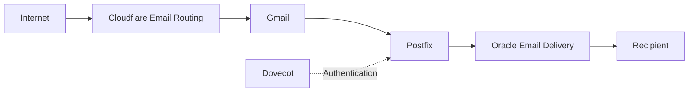
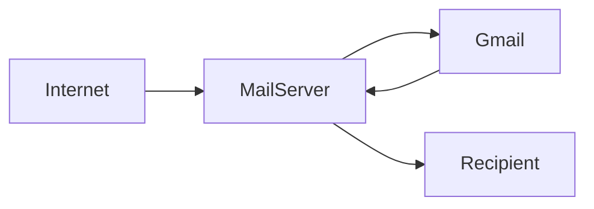

# MailBridge

I built this project because I wanted to use custom-domain email addresses with Gmail without paying for Google Workspace or running a traditional mail server.

MailBridge is a custom-domain email system built around **Gmail, Postfix, Dovecot, MariaDB, Cloudflare Email Routing, and Oracle Cloud Email Delivery**. The goal is to use custom-domain email addresses with Gmail without paying for Google Workspace and without running traditional mailbox storage on the VPS.

The project started as a simple custom-domain email experiment and evolved into a small production-style mail infrastructure project involving SMTP submission, authentication, DNS-based email authentication, relay services, administration, TLS certificate management, and deliverability.

The VPS does **not** store the actual email messages. Gmail remains the actual mailbox, message storage, and primary interface.

---

## What It Does

MailBridge provides:

- Custom-domain email addresses
- Gmail as the primary mailbox interface
- Gmail Send-as support
- Inbound email routing through Cloudflare
- Outbound SMTP submission through Postfix
- SMTP authentication through Dovecot
- MariaDB-backed mail account authentication
- Web-based mailbox administration through PostfixAdmin
- Oracle Cloud Email Delivery as the outbound SMTP relay
- SPF, DKIM and DMARC authentication
- Custom Return-Path configuration
- HTTPS administration through Caddy
- Automatic TLS certificate renewal
- Automatic synchronization of renewed certificates to Postfix

Incoming mail:

```text
Internet
    ↓
Cloudflare Email Routing
    ↓
Gmail
```

Outgoing mail:

```text
Gmail
    ↓
Postfix
    ↓
Oracle Email Delivery
    ↓
Recipient
```

Authentication:

```text
Gmail
    ↓
Postfix
    ↓
Dovecot
```

The server does not store email.

There are no mailboxes, no IMAP service, and no local message storage.

The VPS is only responsible for SMTP submission and authentication.

---

## Why I Built It

I wanted addresses such as:

```text
hello@example.net
contact@example.net
support@example.net
help@example.net
noreply@example.net
postmaster@example.net
abuse@example.net
```

without:

- Google Workspace
- Microsoft 365
- traditional mailbox hosting
- local IMAP storage
- local POP3 storage
- VPS-based email storage
- mailbox hosting
- IMAP administration
- local email storage

I also wanted to understand how modern email delivery actually works and where email actually becomes complicated.

As it turns out, the difficult part is not receiving email.

The difficult part is sending email reliably.

The project became a practical exercise in:

- SMTP
- SMTP authentication
- TLS
- DNS
- SPF
- DKIM
- DMARC
- email routing
- SMTP relays
- sender authorization
- email reputation
- mailbox administration
- certificate management

---

## Constraints

A few requirements shaped every decision:

- Gmail had to remain the primary interface
- No mailbox hosting
- No local email storage
- Professional deliverability
- Low operational overhead

There was also one platform limitation that completely changed the design:

```text
Oracle Cloud blocks outbound port 25.
```

That ruled out direct SMTP delivery almost immediately.

---

## High-Level Architecture

```text
                         INBOUND MAIL
                              │
                              ▼
                       ┌─────────────┐
                       │  Internet   │
                       └──────┬──────┘
                              │
                              ▼
                  ┌───────────────────────┐
                  │ Cloudflare Email      │
                  │ Routing               │
                  └──────────┬────────────┘
                             │
                             ▼
                     ┌───────────────┐
                     │     Gmail     │
                     │ Mailbox/      │
                     │ Storage/UI    │
                     └───────────────┘


                         OUTBOUND MAIL
                              │
                              ▼
                     ┌───────────────┐
                     │     Gmail     │
                     │ Send-as       │
                     └───────┬───────┘
                             │
                       SMTP AUTH + TLS
                             │
                             ▼
                     ┌───────────────┐
                     │    Postfix    │
                     │ SMTP Server   │
                     └───────┬───────┘
                             │
                             ▼
                  ┌───────────────────────┐
                  │ Oracle Email Delivery │
                  │   SMTP Relay :587     │
                  └──────────┬────────────┘
                             │
                             ▼
                          Internet
                             │
                             ▼
                         Recipient
```

Final architecture:


```mermaid
flowchart LR

Internet --> Cloudflare["Cloudflare Email Routing"]
Cloudflare --> Gmail

Gmail --> Postfix

Dovecot -. Authentication .-> Postfix

Postfix --> Oracle["Oracle Email Delivery"]
Oracle --> Recipient
```

---

## Authentication Architecture

Postfix does not authenticate users directly against Linux system accounts.

Dovecot provides the SMTP authentication backend.

```text
                    ┌──────────────────┐
                    │     Gmail        │
                    │   SMTP AUTH      │
                    └────────┬─────────┘
                             │
                             ▼
                    ┌──────────────────┐
                    │     Postfix      │
                    │  SMTP Submission │
                    └────────┬─────────┘
                             │
                        SASL socket
                             │
                             ▼
                    ┌──────────────────┐
                    │     Dovecot      │
                    │   SQL Auth       │
                    └────────┬─────────┘
                             │
                             ▼
                    ┌──────────────────┐
                    │     MariaDB      │
                    │    mailserver    │
                    │     mailbox      │
                    └──────────────────┘
```

Dovecot is therefore being used primarily as an **authentication backend**.

It is not being used as the mailbox storage system.

---

## Mail Storage Model

This is an important architectural decision in MailBridge.

The project does **not** use local virtual mailbox storage.

There is no requirement for:

- Maildir storage
- local mailbox files
- local IMAP mailbox hosting
- local POP3 mailbox hosting
- Dovecot mailbox storage

Instead:

```text
MariaDB
   │
   └── Stores mail account/authentication records

Gmail
   │
   └── Stores actual email messages
```

The database contains account information such as:

```text
username
password hash
active
smtp_active
name
domain
```

It does not contain the user's email messages.

---

## Infrastructure

### Server

The mail server runs on:

```text
Ubuntu 24.04 LTS
ARM64
Oracle Cloud VPS
```

Primary hostname:

```text
mail.example.net
```

Administration hostname:

```text
admin.example.net
```

---

## Core Components

| Component                | Role                                  |
| ------------------------ | ------------------------------------- |
| Gmail                    | Mailbox UI and actual message storage |
| Cloudflare Email Routing | Inbound email routing                 |
| Postfix                  | SMTP submission/server                |
| Dovecot                  | SMTP authentication backend           |
| MariaDB                  | Mail account database                 |
| PostfixAdmin             | Mail account administration GUI       |
| Oracle Email Delivery    | Outbound SMTP relay                   |
| Caddy                    | HTTPS and TLS certificate management  |
| Let's Encrypt            | Public TLS certificates               |
| systemd                  | Certificate synchronization timer     |

---

## Postfix

Postfix is the central SMTP component.

It accepts authenticated SMTP submissions from Gmail and forwards the messages to Oracle Cloud Email Delivery.

SMTP submission is provided over:

```text
TCP 587
```

The authentication flow is:

```text
Gmail
   ↓
TLS
   ↓
Postfix :587
   ↓
Dovecot SASL
   ↓
MariaDB
```

Postfix then relays authenticated mail to:

```text
smtp.email.<region>.oci.oraclecloud.com:587
```

---

## Dovecot

Dovecot is used for SMTP authentication.

Instead of using Linux/PAM accounts as the primary authentication database, MailBridge uses MariaDB.

The SQL authentication flow is:

```text
Postfix
    ↓
Dovecot SASL
    ↓
MariaDB
    ↓
mailbox table
```

The authentication query checks that the account is active and enabled for SMTP authentication.

Conceptually:

```sql
SELECT username AS user, password
FROM mailbox
WHERE username = '%u'
  AND active = '1'
  AND smtp_active = '1';
```

Passwords are stored as cryptographic password hashes.

Plaintext passwords are not stored in the database.

---

## MariaDB

The database is:

```text
mailserver
```

Important tables include:

```text
domain
mailbox
alias
alias_domain
domain_admins
config
vacation
```

The `mailbox` table represents mail accounts managed by PostfixAdmin.

Example conceptual record:

```text
username:    user@example.net
active:      1
smtp_active: 1
```

The database is an **authentication and administration database**.

It is not an email-message database.

---

## PostfixAdmin

PostfixAdmin provides the web-based administration interface for MailBridge.

Installation location:

```text
/srv/postfixadmin
```

PostfixAdmin manages:

- domains
- mailboxes
- aliases
- mailbox status
- administrator accounts
- mailbox authentication data

The administration interface is served through:

```text
https://admin.example.net/
```

PostfixAdmin uses MariaDB as its backend.

The relationship is:

```text
PostfixAdmin
      │
      ▼
   MariaDB
      │
      ▼
 mailbox records
```

---

## Password Expiration

PostfixAdmin's password-expiration feature is disabled.

The local configuration contains:

```php
$CONF['password_expiration'] = 'NO';
```

This means mailbox passwords are not automatically expired by PostfixAdmin.

The setting is stored in:

```text
/srv/postfixadmin/config.local.php
```

The default PostfixAdmin configuration is not modified directly.

Local overrides are kept in `config.local.php`.

---

## Gmail Integration

Gmail is used as the primary mail interface.

Gmail's "Send mail as" functionality is configured to use:

```text
mail.example.net
```

over:

```text
SMTP port: 587
TLS: enabled
SMTP authentication: enabled
```

For shared sender identities, Gmail authenticates through the common service account:

```text
gmailrelay@example.net
```

The visible sender can then be an approved address such as:

```text
hello@example.net
contact@example.net
support@example.net
noreply@example.net
postmaster@example.net
```

The authentication identity and visible From address therefore do not necessarily have to be the same.

---

## Shared Sender Architecture

Multiple sender identities can authenticate through the same SMTP service account.

Conceptually:

```text
hello@example.net
contact@example.net
support@example.net
noreply@example.net
        │
        ▼
gmailrelay@example.net
        │
        ▼
Postfix
        │
        ▼
Oracle Email Delivery
```

Oracle Email Delivery must authorize the sender identities used by the system.

SMTP authentication and sender authorization are separate concepts.

---

## Alias Support

One requirement from the beginning was support for multiple aliases:

```text
hello@
contact@
support@
help@
noreply@
abuse@
postmaster@
```

All aliases now send through a single authenticated SMTP account while preserving the correct sender identity.

---

## Cloudflare Email Routing

Inbound mail is handled by Cloudflare Email Routing.

The flow is:

```text
Internet
    ↓
Cloudflare Email Routing
    ↓
Gmail
```

Examples of configured inbound addresses include:

```text
contact@example.net
admin@example.net
postmaster@example.net
abuse@example.net
notifications@example.net
help@example.net
sender@example.net
hello@example.net
```

Cloudflare performs the inbound forwarding.

PostfixAdmin aliases are therefore not responsible for the primary inbound routing architecture.

---

## Oracle Cloud Email Delivery

Oracle Email Delivery is used as the outbound SMTP relay.

The relay endpoint is:

```text
smtp.email.<region>.oci.oraclecloud.com:587
```

This is necessary because direct outbound SMTP delivery on TCP/25 is not available from the Oracle Cloud environment used by the project.

The final outbound flow is:

```text
Gmail
   ↓
Postfix :587
   ↓
Oracle Email Delivery :587
   ↓
Internet
```

Oracle handles delivery to the recipient's mail server.

---

## Why A Relay Is Required

The initial design attempted to send mail directly from Postfix:

```text
Postfix
   ↓
Internet
```

This was not viable because outbound TCP/25 was blocked.

The architecture therefore changed to:

```text
Postfix
   ↓
Oracle Email Delivery
   ↓
Internet
```

This also separates SMTP submission from final internet delivery.

---

## Email Authentication

MailBridge uses the standard email authentication mechanisms:

```text
SPF
DKIM
DMARC
```

These are configured for the sending domain.

Successful tests have shown:

```text
SPF: PASS
DKIM: PASS
DMARC: PASS
```

Authentication does not guarantee inbox placement.

Mailbox providers can also consider:

- sender reputation
- domain reputation
- message content
- recipient interaction
- sending patterns
- historical behavior
- forwarding paths

---

## DKIM

Oracle Email Delivery signs outbound messages using DKIM.

The sending domain has a DKIM selector associated with Oracle Email Delivery.

Messages can therefore be authenticated as:

```text
d=example.net
```

This allows the recipient to verify that the message was authorized by the domain.

---

## DMARC

DMARC aligns the visible From domain with authenticated SPF and/or DKIM identities.

The domain uses a DMARC policy.

The system has been tested successfully with:

```text
DMARC: PASS
```

---

## Custom Return-Path

MailBridge uses a custom Return-Path domain associated with Oracle Email Delivery.

Example:

```text
bom1.rp.example.net
```

This allows the SMTP envelope sender/bounce domain to be associated with the project domain while Oracle Email Delivery remains the underlying delivery provider.

---

## TLS

SMTP submission uses TLS.

Postfix presents:

```text
mail.example.net
```

as its TLS hostname.

The certificate is issued by Let's Encrypt.

---

## Caddy

Caddy is used for HTTPS and certificate management.

It provides HTTPS for services including:

```text
mail.example.net
```

and also manages the public certificate for:

```text
mail.example.net
```

The mail hostname is included in the Caddy configuration specifically so Caddy can automatically obtain and renew its Let's Encrypt certificate.

---

## Postfix TLS Certificate Synchronization

Postfix does not directly use Caddy's certificate storage.

Instead, the certificate is synchronized from Caddy's certificate storage into:

```text
/etc/postfix/tls/
```

The synchronization script is:

```text
/usr/local/sbin/sync-postfix-caddy-cert.sh
```

The process is:

```text
Let's Encrypt
      ↓
    Caddy
      ↓
Certificate renewal
      ↓
systemd timer
      ↓
sync-postfix-caddy-cert.sh
      ↓
/etc/postfix/tls/
      ↓
Postfix reload
```

The script first compares the Caddy certificate/key with the Postfix copies.

If they are unchanged:

```text
Postfix certificate is already up to date.
```

No reload is performed.

If Caddy has renewed the certificate:

```text
New Caddy certificate detected.
Updating Postfix...
```

The certificate and key are copied and Postfix is reloaded.

---

## Automatic Certificate Synchronization

A systemd service is used:

```text
sync-postfix-caddy-cert.service
```

and a timer:

```text
sync-postfix-caddy-cert.timer
```

The timer checks every six hours.

Example:

```ini
[Timer]
OnBootSec=5min
OnUnitActiveSec=6h
Persistent=true
```

This means certificate renewal does not depend on manually copying files.

Caddy handles renewal.

The systemd timer handles synchronization.

---

## TLS Failure That Led To This Design

At one point Gmail reported:

```text
TLS Negotiation failed,
the certificate doesn't match the host.
```

Initial investigation showed that the hostname and SAN were correct.

The actual problem was that the certificate had expired.

The expired certificate contained:

```text
CN = mail.example.net
```

but its expiration date had already passed.

Caddy had previously obtained the certificate, but the mail hostname was no longer included as an active Caddy site, so Caddy was not automatically managing that certificate.

The fix was:

1. Add `mail.example.net` to Caddy.
2. Allow Caddy to renew the certificate.
3. Copy the renewed certificate to Postfix.
4. Reload Postfix.
5. Verify the live certificate with OpenSSL.
6. Add automatic certificate synchronization.

The renewed certificate is now automatically maintained.

---

## Testing TLS

The live Postfix certificate can be inspected with:

```bash
sudo openssl s_client \
  -connect mail.example.net:587 \
  -starttls smtp \
  -servername mail.example.net \
  </dev/null 2>/dev/null |
openssl x509 -noout \
  -subject \
  -issuer \
  -dates \
  -ext subjectAltName
```

The hostname should appear in the certificate SAN.

---

## Database Administration

The MariaDB database can be inspected directly from the Ubuntu terminal.

Show databases:

```bash
sudo mariadb -e "SHOW DATABASES;"
```

Show MailBridge tables:

```bash
sudo mariadb mailserver -e "SHOW TABLES;"
```

Show mailbox structure:

```bash
sudo mariadb mailserver -e "DESCRIBE mailbox;"
```

Show active mail accounts without exposing password hashes:

```bash
sudo mariadb mailserver -e \
"SELECT username, name, active, smtp_active FROM mailbox;"
```

The database can therefore be demonstrated directly from the terminal during project presentations.

---

## Security Considerations

The project separates authentication, administration and mail delivery responsibilities.

Important security measures include:

- SMTP submission uses TLS
- SMTP authentication is required
- Passwords are stored as hashes
- Database credentials are kept out of public documentation
- TLS private keys are protected with restricted permissions
- PostfixAdmin configuration is separated from the application's default configuration
- Caddy manages public HTTPS certificates
- Postfix does not act as an open relay
- Oracle Email Delivery is used for outbound delivery
- Linux service permissions are used where appropriate

Secrets must never be committed to the repository.

---

## Important Ports

| Port | Service | Purpose                                          |
| ---- | ------- | ------------------------------------------------ |
| 25   | Postfix | SMTP server traffic if enabled by the deployment |
| 587  | Postfix | Authenticated SMTP submission                    |
| 80   | Caddy   | HTTP / ACME certificate challenges               |
| 443  | Caddy   | HTTPS administration                             |
| 3306 | MariaDB | Internal database service (do not expose publicly) |

MariaDB must not be exposed publicly.

---

## Mail Flow Examples

### Sending From Gmail

```text
Gmail
   │
   │ SMTP AUTH + TLS
   ▼
mail.example.net:587
   │
   ▼
Postfix
   │
   │ SMTP relay
   ▼
Oracle Email Delivery
   │
   ▼
Recipient Mail Server
   │
   ▼
Recipient Inbox
```

### Receiving Mail

```text
External Sender
       │
       ▼
Internet
       │
       ▼
Cloudflare Email Routing
       │
       ▼
Gmail
       │
       ▼
Gmail Mailbox
```

### Authentication

```text
Gmail
   │
   ▼
Postfix
   │
   ▼
Dovecot SASL
   │
   ▼
MariaDB
   │
   ▼
mailbox table
```

---

## What The VPS Does Not Do

The VPS is not a traditional mailbox server.

It does not provide the primary:

- mailbox storage
- IMAP storage
- POP3 storage
- email message database

Instead, its main responsibilities are:

```text
SMTP submission
SMTP authentication
Outbound relay
Mail account administration
TLS certificate management
```

Gmail remains responsible for the actual mailbox experience and message storage.

---

## Troubleshooting

### Gmail Cannot Authenticate

Check:

```text
Postfix
    ↓
Dovecot
    ↓
MariaDB
```

Useful checks:

```bash
sudo doveconf -n
sudo systemctl status dovecot
sudo tail -f /var/log/mail.log
```

### SMTP Authentication Fails

Verify the mailbox exists and is enabled:

```bash
sudo mariadb mailserver -e \
"SELECT username, active, smtp_active FROM mailbox;"
```

Check the Dovecot SQL configuration and authentication logs.

### Oracle Authentication Fails

Check the Postfix relay configuration and SASL password map.

Typical errors include:

```text
535 Authentication required
```

This generally indicates an SMTP authentication problem.

### Oracle Sender Authorization Fails

A different error is:

```text
535 Authorization failed
Envelope From address not authorized
```

This means the SMTP credentials may be valid, but Oracle does not authorize the sender identity being used.

Authentication and authorization are separate.

### Gmail Reports TLS Errors

Check the live certificate:

```bash
sudo openssl s_client \
  -connect mail.example.net:587 \
  -starttls smtp \
  -servername mail.example.net \
  </dev/null 2>/dev/null |
openssl x509 -noout \
  -subject \
  -issuer \
  -dates \
  -ext subjectAltName
```

Check the synchronization service:

```bash
systemctl status sync-postfix-caddy-cert.service --no-pager
```

Check the timer:

```bash
systemctl list-timers --all | grep sync-postfix
```

---

## Validation

The system has been tested end-to-end.

### Inbound

```text
External Sender
    ↓
Cloudflare Email Routing
    ↓
Gmail
```

Result:

Successful delivery.

### Outbound

```text
Gmail
    ↓
Postfix
    ↓
Oracle Email Delivery
    ↓
Recipient
```

Result:

Successful delivery.

### Authentication

Mail headers have been verified with:

```text
SPF: PASS
DKIM: PASS
DMARC: PASS
```

### SMTP Logs

Successful Postfix delivery produces entries such as:

```text
sasl_username=gmailrelay

to=<recipient@example.net>

dsn=2.0.0

status=sent (250 Ok)
```

These confirm:

- SMTP authentication worked
- relay authentication worked
- sender authorization worked
- delivery succeeded

---

## Deliverability

Authentication is necessary but does not guarantee that messages will always reach the inbox.

The project has been tested using external mail-testing services.

Previous testing confirmed:

- SPF configured correctly
- DKIM configured correctly
- DMARC configured correctly
- reverse DNS for the relay infrastructure
- no major public blocklist listing
- message formatting checks passed

Inbox placement can still vary because receiving providers use additional reputation and content signals.

---

## How The Architecture Evolved

### Initial Idea

The first design looked something like:


```mermaid
flowchart LR

Internet --> MailServer
MailServer --> Gmail

Gmail --> MailServer
MailServer --> Recipient
```

One server.

One place to manage everything.

Simple in theory.

### Solving Inbound Email

Cloudflare Email Routing changed the project almost immediately.


```mermaid
flowchart LR

Internet --> Cloudflare
Cloudflare --> Gmail
```

Once this was working:

- mailbox hosting disappeared
- IMAP disappeared
- mail storage disappeared

Inbound email was effectively solved.

### Direct SMTP Delivery

For outbound mail, I initially planned to send directly from Postfix.


```mermaid
flowchart LR

Postfix --> Internet
```

That failed.

Oracle blocks outbound TCP/25, which prevents direct SMTP delivery to recipient mail servers.

The architecture needed a relay.

### Evaluating Stalwart

Before settling on Postfix, I spent some time evaluating Stalwart Mail Server.

The appeal was obvious:

- modern architecture
- integrated services
- simpler deployment model

In practice I ran into deployment and authentication issues.

I eventually moved to Postfix because it was easier to troubleshoot and had a much larger ecosystem behind it.

### Gmail Authentication Problems

After Postfix was running, Gmail still could not send mail through it.

Authentication failed repeatedly.

The missing component was Dovecot.

Most people associate Dovecot with mailbox access.

In this project it serves a much smaller purpose:

```text
Dovecot
    ↓
SMTP Authentication
```

Once Dovecot was integrated as the SASL backend, Gmail authentication started working.

### Oracle Authentication Failure

The next problem came from Oracle Email Delivery:

```text
535 Authentication required
```

Postfix was not correctly using the relay credentials.

After correcting the SASL configuration and rebuilding the password map, authentication succeeded.

### Oracle Authorization Failure

The next error looked similar but turned out to be a completely different problem:

```text
535 Authorization failed
Envelope From address not authorized
```

Authentication was working.

Authorization was not.

The SMTP account was valid, but Oracle had not approved the sender identity being used.

After configuring approved senders, outbound delivery finally succeeded.

### Certificate Expiration

A later Gmail SMTP failure reported a TLS certificate problem.

Investigation showed that the certificate for:

```text
mail.example.net
```

had expired.

The certificate was renewed through Caddy and copied to Postfix.

This led to the final automated certificate synchronization design:

```text
Caddy
   ↓
Let's Encrypt renewal
   ↓
systemd timer
   ↓
certificate synchronization
   ↓
Postfix reload
```

---

## What Finally Worked

The final outbound path became:

```text
Gmail
    ↓
Postfix
    ↓
Oracle Email Delivery
    ↓
Recipient
```

while Dovecot handled SMTP authentication.

At that point:

- Gmail could authenticate
- Oracle accepted the relay
- authorized aliases could send mail
- messages reached external inboxes successfully

---

## Lessons Learned

### Receiving Email Is Easy

Cloudflare Email Routing solved inbound email much faster than expected.

### Sending Email Is Hard

SMTP authentication, sender authorization, DNS authentication, relay configuration, TLS, reputation and recipient policies all matter.

Getting a message accepted by a remote server is only part of the problem.

### Authentication And Authorization Are Different

This was responsible for one of the longest debugging sessions in the project.

A valid SMTP login does not automatically grant permission to use every sender address.

### Cloud Providers Shape Architecture

The final outbound design exists largely because Oracle blocks direct SMTP delivery on port 25.

### Email Is Mostly About Trust

Before this project I assumed SMTP was the difficult part.

In reality, SPF, DKIM, DMARC, reputation, and policy enforcement are just as important.

### Certificate Automation Matters

A certificate can be perfectly valid when initially deployed and still expire later if renewal is not connected to the service actually using it.

The final design therefore separates:

```text
Certificate renewal
        ↓
Certificate synchronization
        ↓
Service reload
```

---

## Future Improvements

Possible future improvements include:

- Terraform-managed DNS
- Automated deployment with Ansible
- Monitoring and alerting
- Secondary outbound relay
- Infrastructure as Code
- Automated configuration validation
- Better deliverability monitoring
- Backup automation
- Fresh-server deployment testing

---

## Documentation

| File                             | Purpose                            |
| -------------------------------- | ---------------------------------- |
| `docs/glossary.md`               | Definitions of technical terms     |
| `docs/debugging-journal.md`      | Major failures and troubleshooting |
| `docs/architecture-decisions.md` | Design decisions and trade-offs    |
| `docs/deployment-guide.md`       | Deployment process                 |
| `docs/lessons-learned.md`        | Additional project reflections     |

---

## Repository Structure

```text
mailbridge/
│
├── README.md
│
├── configs/
│   ├── postfix/
│   ├── dovecot/
│   ├── postfixadmin/
│   └── caddy/
│
├── scripts/
│   └── sync-postfix-caddy-cert.sh
│
├── docs/
│   ├── glossary.md
│   ├── debugging-journal.md
│   ├── architecture-decisions.md
│   ├── deployment-guide.md
│   └── lessons-learned.md
│
├── screenshots/
│
├── diagrams/
│
└── assets/
```

---

## Project Summary

MailBridge is intentionally not a traditional self-hosted mailbox server.

It combines several specialized services:

```text
                 ┌───────────────────────┐
                 │        Gmail          │
                 │ Mailbox + Storage     │
                 └───────────┬───────────┘
                             │
                       SMTP AUTH/TLS
                             │
                             ▼
                 ┌───────────────────────┐
                 │       Postfix         │
                 │ SMTP Submission       │
                 └───────────┬───────────┘
                             │
                             ▼
                 ┌───────────────────────┐
                 │ Oracle Email Delivery │
                 │ Outbound Relay        │
                 └───────────────────────┘


                 ┌───────────────────────┐
                 │     PostfixAdmin      │
                 │   Administration UI   │
                 └───────────┬───────────┘
                             │
                             ▼
                 ┌───────────────────────┐
                 │       MariaDB         │
                 │ Authentication Data   │
                 └───────────┬───────────┘
                             │
                             ▼
                 ┌───────────────────────┐
                 │       Dovecot         │
                 │     SQL / SASL Auth   │
                 └───────────────────────┘


                 ┌───────────────────────┐
                 │      Cloudflare       │
                 │   Email Routing       │
                 └───────────┬───────────┘
                             │
                             ▼
                          Gmail
```

The result is a lightweight custom-domain email system where:

- Gmail provides the mailbox experience and storage.
- Cloudflare handles inbound routing.
- Postfix handles SMTP submission.
- Dovecot handles authentication.
- MariaDB stores mail account information.
- PostfixAdmin provides administration.
- Oracle Email Delivery handles outbound delivery.
- Caddy manages HTTPS and certificate renewal.
- systemd automatically keeps Postfix's TLS certificate synchronized.

The project demonstrates how multiple specialized services can be combined into a working email platform without hosting the actual mailboxes on the VPS.
